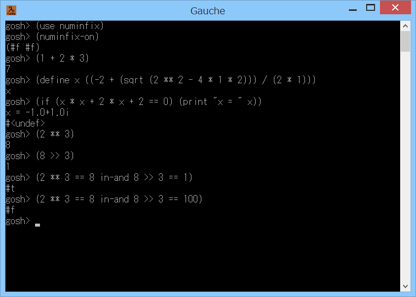

# numinfix



## 概要
- Gaucheで中置記法による数値演算を可能にするためのモジュールです。  
  例えば (1 + 2 * 3) などと書けるようになります。


## インストール方法
- numinfix.scm を Gauche でロード可能なフォルダにコピーします。  
  (例えば (gauche-site-library-directory) で表示されるフォルダ等)


## 使い方
- 中置記法による数値演算を可能にするモードに入る場合
```
    (use numinfix)
    (numinfix-on)
```

- 中置記法による数値演算を可能にするモードを抜ける場合
```
    (numinfix-off)
```

- 使用可能な演算子 (レベルが小さいほど優先順位が高い)
```
    レベル1 : **              (べき乗)
    レベル2 : * / *. /. \ %   (乗算,除算,不正確数乗算,不正確数除算,整数除算,整数剰余)
    レベル3 : + - +. -.       (加算,減算,不正確数加算,不正確数減算)
    レベル4 : << >>           (左ビットシフト,右ビットシフト (正確整数の符号付きシフトのみ))
    レベル5 : < <= > >= == != (数値比較 (戻り値は論理値(#tか#f)になる。大小比較は実数のみ))
    レベル6 : logand logior logxor (ビットAND,ビットOR,ビットXOR (正確整数のみ))
    レベル7 : in-and in-or    (AND,OR (戻り値は論理値(#tか#f)になる。短絡評価にはならない))
```

- ジェネリック関数のメソッドの競合について
```
    もし、ジェネリック関数 object-apply の以下のメソッド
      (define-method object-apply ((n <number>) . rest) ...
      (define-method object-apply ((n <boolean>) . rest) ...
    が、すでに定義されていた場合には、上書きしてしまいます。
    そのような場合は、モードに入るときに
      (define mold (numinfix-on))
    として、元のメソッドを保存してください。
    そして、モードを抜けるときに
      (numinfix-off mold)
    として、元のメソッドに戻してください。
    (ただし、モードに入っている間は、元のメソッドは使用できないので注意)
```


## 注意事項
1. リストの先頭が数値であった場合に、中置記法を処理するように  
   ジェネリック関数 object-apply に数値用と論理値用のメソッドを追加しています。  
   ジェネリック関数 object-apply はグローバルであるため、競合が発生する可能性が  
   あります。例えば、他のモジュールでもジェネリック関数 object-apply に  
   数値用や論理値用のメソッドを追加していたりすると、正常に動作しなくなります。

2. 数値と演算子の間にはスペースが必要です。  
   また、式全体を括弧でくくる必要があります。

3. 演算子の優先順位比較等の計算コストがかかります。

4. 他のモジュールとの演算子記号のバッティングに注意が必要です。

5. 中置記法は、2項演算子のみ対応です。  
   例えば、単項演算の - を混ぜて記述することはできません。  
   すなわち (- 1 + 2) はエラーになります。  
   ただし   (-1 + 2)  のように - と数字の間にスペースを入れずに書けば、  
   ひとつの数値と解釈されるため計算可能です。

6. 数値のみ対応です(文字、文字列、ベクタ等は非対応)(ただしin-andとin-orは論理値に対応)。

7. 中置記法の式の中でも、括弧でくくれば通常の前置記法を使用可能です。  
   例えば (5 * (+ 1 1) * 2) や ((cos 0) + 1) のように混在して記述できます。


## 参考情報
1. Gauche:数式の中置記法  
   http://practical-scheme.net/wiliki/wiliki.cgi?Gauche%3A%E6%95%B0%E5%BC%8F%E3%81%AE%E4%B8%AD%E7%BD%AE%E8%A8%98%E6%B3%95  
   ここのコードを元に改造、デバッグしました。  
   不具合としては、以下がありました。  
   - (1 - 2 * 3 - 4) と (1 - 6 - 4) が同じ結果にならない  
     (間に優先順位の高い演算子が入ると、右側の演算(上記では - 4)を先に計算してしまう。  
      このため、結合則の成り立たない減算や除算では結果が違ってしまう)
   - (1 2 3)を計算すると無限ループになる  
     (2を演算子として (2 1 3) を計算しようとするが、これをまた、  
      1を演算子として (1 2 3) を計算しようとして、無限ループになる)


## 環境等
- 以下の環境で動作を確認しました。
  - OS
    - Windows XP Home SP3
    - Windows 8 (64bit)
  - 言語
    - Gauche v0.9.4
    - Gauche v0.9.3.3

## 履歴
- 2014-8-29 v1.00 (初版)
- 2014-8-30 v1.01 コメント修正のみ
- 2014-8-30 v1.02 コメント修正のみ
- 2014-8-31 v1.03 演算処理見直し
- 2014-8-31 v1.04 一部処理見直し
- 2014-8-31 v1.05 連想リスト→ハッシュテーブルに変更。演算処理見直し
- 2014-8-31 v1.06 コメント削除のみ
- 2014-8-31 v1.07 数値比較とin-and,in-orの演算子を追加。論理値対応
- 2014-8-31 v1.08 コメント修正。インデント見直し
- 2014-9-2  v1.09 コメント修正のみ
- 2014-9-5  v1.10 コメント修正のみ
- 2014-9-17 v1.11 コメント修正のみ


(2014-9-17)
